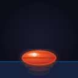
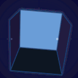
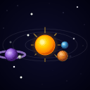

# guff

Generate animated GIFs using AI. Claude writes TypeScript code that programmatically generates SVG animation frames using math and loops, which are then converted to PNGs and assembled into optimized GIFs.

Inspired by the [Modal claude-slack-gif-creator](https://github.com/modal-projects/claude-slack-gif-creator) example and the Anthropic [slack-gif-creator skill](https://github.com/anthropics/skills/blob/main/slack-gif-creator/SKILL.md), which use Claude to generate animation code instead of pixel images. Also supports Gemini's image generation as an alternative provider.

## Examples

| | | | |
|:---:|:---:|:---:|:---:|
|  |  |  |  |
| `a bouncing ball` | `a spinning star` | `a pulsing heart` | `a rotating cube` |
|  |  |  |  |
| `a waving flag` | `a flickering flame` | `orbiting planets` | `a dancing penguin` |

## Usage

Set your API key:

```sh
export ANTHROPIC_API_KEY=your-key-here
```

```sh
bunx guff-gif@latest [options] <prompt>
```

### Examples

```sh
bunx guff-gif@latest 'a bouncing ball'
bunx guff-gif@latest -f 16 -s 256x256 'a spinning star'
bunx guff-gif@latest -D 50 'a pulsing heart'
bunx guff-gif@latest -d 'a dancing penguin'  # debug: see generated code
bunx guff-gif@latest -m gemini/gemini-2-flash-preview-image-generation 'a waving hand'
```

### Options

| Flag | Description | Default |
|------|-------------|---------|
| `-f, --frames` | Number of animation frames | `32` |
| `-D, --delay` | Delay between frames in ms | `100` |
| `-s, --size` | Output size in `WxH` format | `128x128` |
| `-c, --colors` | Max colors in GIF palette | `256` |
| `-t, --temperature` | Temperature `0.0`-`2.0` | `1.0` |
| `-o, --output` | Output filename | Auto-generated from prompt |
| `-i, --input` | Input image(s) for reference (repeatable) | None |
| `-d, --debug` | Log full prompt, API details, and generated code | Off |
| `-m, --model` | Provider/model | `claude/claude-sonnet-4-6` |
| `-a, --aspect` | Frame aspect ratio (Gemini only) | `1:1` |
| `-r, --resolution` | Resolution: `1k`, `2k`, `4k` (Gemini only) | `1k` |

### How it works

1. Your prompt is sent to Claude with a system prompt instructing it to write a self-contained TypeScript script
2. Claude generates code that creates SVG strings for each frame using `Math.sin`, `Math.cos`, template literals, etc.
3. The script is executed with `bun run` and outputs a JSON array of SVG strings to stdout
4. Each SVG is converted to a PNG frame using [sharp](https://sharp.pixelplumbing.com/)
5. Frames are assembled into an optimized GIF using [gifsicle](https://www.lcdf.org/gifsicle/)

### Requirements

- [Bun](https://bun.sh/)
- [gifsicle](https://www.lcdf.org/gifsicle/) (`brew install gifsicle`)

---

Built entirely with [Claude Code](https://claude.ai/claude-code).
